<!--
_class: title
-->

$$
\renewcommand{\bm}[1]{{\boldsymbol{#1}}}
$$

<!--
_class: title
-->

# 3. 双曲型偏微分方程式の解法 (1)：線形問題

#### 参考文献
- 藤井孝蔵. (1994). 流体力学の数値計算法. 東京大学出版会.
- LeVeque, R. J. (1990). Numerical Methods for Conservation Laws. Numerical Methods for Conservation Laws. Basel: Springer Berlin Heidelberg. https://doi.org/10.1007/978-3-0348-5116-9
- Laney, C. B. (1998). Computational Gasdynamics. Cambridge University Press. https://doi.org/10.1017/CBO9780511605604
- Toro, E. F. (2009). Riemann Solvers and Numerical Methods for Fluid Dynamics. Riemann Solvers and Numerical Methods for Fluid Dynamics: A Practical Introduction. Berlin, Heidelberg: Springer Berlin Heidelberg. https://doi.org/10.1007/b79761

---
## 3.1 線形移流方程式

ここでは特に断りの無い限りは以下の線形移流方程式の初期値・境界値問題を考える．ただし$c$は定数である．
$$
\frac{\partial u}{\partial t} + c \frac{\partial u}{\partial x} = 0
$$
初期値$u(x,t=0)$が与えられたときの解析解は以下で与えられ，初期に与えられたプロファイルが一定速度$c$で$x$の正方向に伝播する．
$$
u(x, t) = u(x - ct, 0)
$$

一見この方程式は簡単に解けそうにも思えるが，精度良く数値解を得るのは意外と難しい．またこの問題の数値解法は流体方程式などの非線形の双曲型偏微分方程式の解法の基礎となっている．（線形問題が解けないのであれば非線形問題が解けるわけがない！）

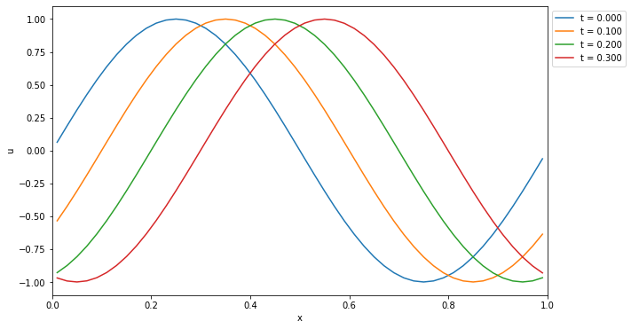

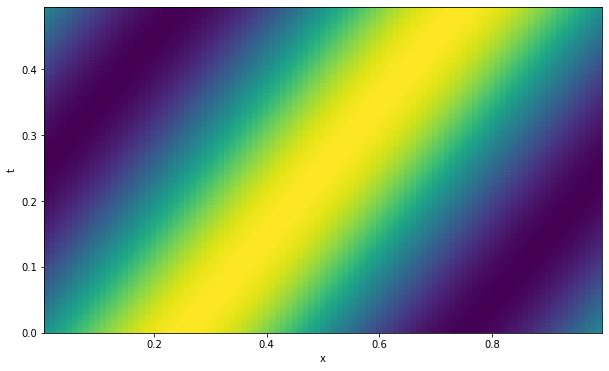

---

ここでは安直な差分近似を用いた線形移流方程式の数値解法を考えてみよう．解を時間・空間方向に離散化し，$u^{n}_{i}$ と書こう．ここで時間方向の格子点（時間ステップ）を上付き添字 $^n$ ，空間方向の格子点を下付き添字 $_i$ で現す．  
時間方向の差分には過去の情報だけを用いて前進差分，空間方向は前後のバイアスがない中心差分を用いると，解くべき方程式は
$$
\frac{u^{n+1}_{i} - u^{n}_{i}}{\Delta t} + c \frac{u^{n}_{i+1} - u^{n}_{i-1}}{2 \Delta x} = 0
$$
と書ける．これを書き換えて
$$
u^{n+1}_{i} = u^{n}_{i} - \left( \frac{c \Delta t}{2 \Delta x} \right)
\left( u^{n}_{i+1} - u^{n}_{i-1} \right)
$$
を得る．右辺は$u^{n}_{i-1}, u^{n}_{i}, u^{n}_{i+1}$の情報のみで評価でき，これらから次のステップの解$u^{n}_{i}$が求まる．

数値解を求めるためのアルゴリズムは一般に数値計算**スキーム**と呼ばれる．この場合は時間方向に前進差分，空間方向に中心差分を用いているのでFTCSスキーム（Forward in Time and Centered in Space)と呼ばれる．

---
### 例：FTCSスキームによる数値解

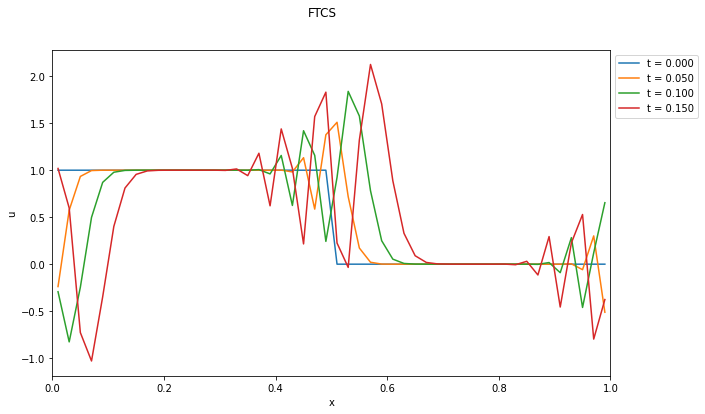

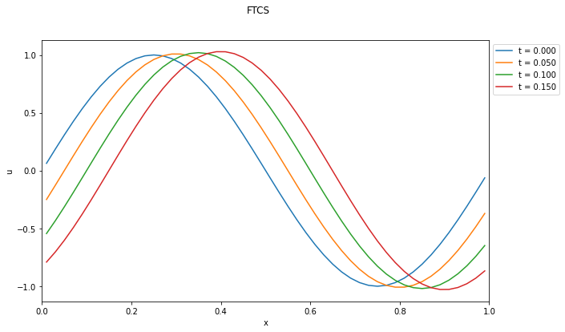

####
####
####
####
####
####
####
####
####
####

- 矩形波（急勾配がある場合）の計算結果は明らかにおかしい．
- 初期条件が滑らかな関数であれば良さそうに見えるが・・・？

---
## 3.2 数値計算スキームの性質

### 適合性

離散化の刻み幅を小さくしていくにつれて離散近似が元の微分方程式に近づくとき，そのスキームは「適合」すると呼ぶ．適合性は自然に満たされることが多い．

### 収束性

離散化の刻み幅を小さくしていくにつれて，数値解が元の微分方程式の解に近づくことを「収束」すると呼ぶ．収束するスキームであれば十分な離散点をとれば（原理的には）誤差をいくらでも小さくすることができる．

### 安定性

時間発展型の方程式の数値計算スキームについて適用される概念．スキームの数値的な誤差が時間的に増大しないとき，そのスキームは「安定」であると呼ぶ．数値的に安定でないスキームは実用的には使えない．詳細は次節で述べる．

---
### 例：FTCSスキーム（移流方程式）

時間・空間の両方向についてTaylor展開すると
$$
\begin{aligned}
\frac{u^{n+1}_{i} - u^{n}_{i}}{\Delta t} + c \frac{u^{n}_{i+1} - u^{n}_{i-1}}{2 \Delta x}
&=
\left( \frac{\partial u}{\partial t} \right)^{n}_{i} +
c \left( \frac{\partial u}{\partial x} \right)^{n}_{i}
\\
&+
\frac{\Delta t}{2} \left( \frac{\partial^2 u}{\partial t^2} \right)^{n}_{i} +
c\frac{\Delta x^2}{12} \left( \frac{\partial^3 u}{\partial x^3} \right)^{n}_{i}
+ \text{(higher orders)}
\end{aligned}
$$
これからFTCSスキームの打ち切り誤差は $\mathcal{O}(\Delta t, \Delta x^2)$ であることが分かる．

$\Delta t$や$\Delta x$を小さくしていくにつれて差分近似は明らかに元の微分方程式に近づくので，このスキームは適合する．一方で，収束性は実際に得られた数値解によって判断すべきものなので，これだけからは分からない．ただし，我々は実験的にこのスキームが不安定であることを知っているので，収束性も満たさないことは明らかである．

#### Q.3-1
Taylor展開によって実際に上記のFTCSスキームの打ち切り誤差評価が正しいことを示せ．

---
### 例：数値解の収束性

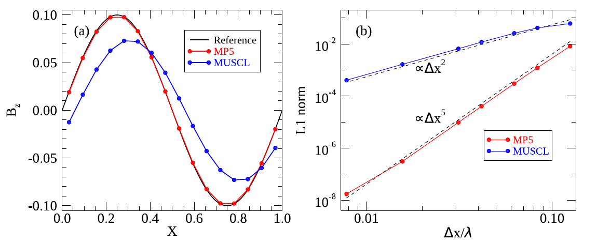

<!--
_header: Ref: Matsumoto et al. (2019, PASJ)
-->

---
## 3.3 von Neumannの安定性解析
差分法の数値的安定性を調べるために最も一般的に使われている手法がvon Neumannの安定性解析である．これは「等間隔格子($\Delta t$および$\Delta x$が一定)で構成した線形差分近似式による初期値問題の解法」に適用可能な手法である．適用可能範囲が狭いようにも思われるが，実用的にはこれによって十分に有用な結果が得られる．

上記の定義により線形の問題を考えよう．空間方向の任意の関数はFourier級数で現すことができるが，各波数のモードは互いに独立であるから，一つの波数$k$について考えれば十分である．既に空間方向の格子点の添字に$i$を使っているので，以降では$j$を虚数単位として用いることとする．（すなわち $j^2 = -1$．）

$x_{i} = i \Delta x$とすれば，波数$k$のモードの解は以下のように書ける．
$$
u^{n}_{i} = \tilde{u}^n \exp[j (i k \Delta x)] = \tilde{u}^n \exp[j (i \theta)]
\quad (\theta = k \Delta x)
$$
ここで $\tilde{u}^n$ は複素振幅である．これを差分式に代入して解の時間発展の性質を調べてみよう．

なお，以降では
$$
\nu \equiv \frac{c \Delta t}{\Delta x}
$$
と置き，これを**Courant数**と呼ぶ．すぐに明らかになるように，Courant数は特に双曲型偏微分方程式の数値解の性質を決定する非常に重要な量である．

---
### 波長と解像度の関係

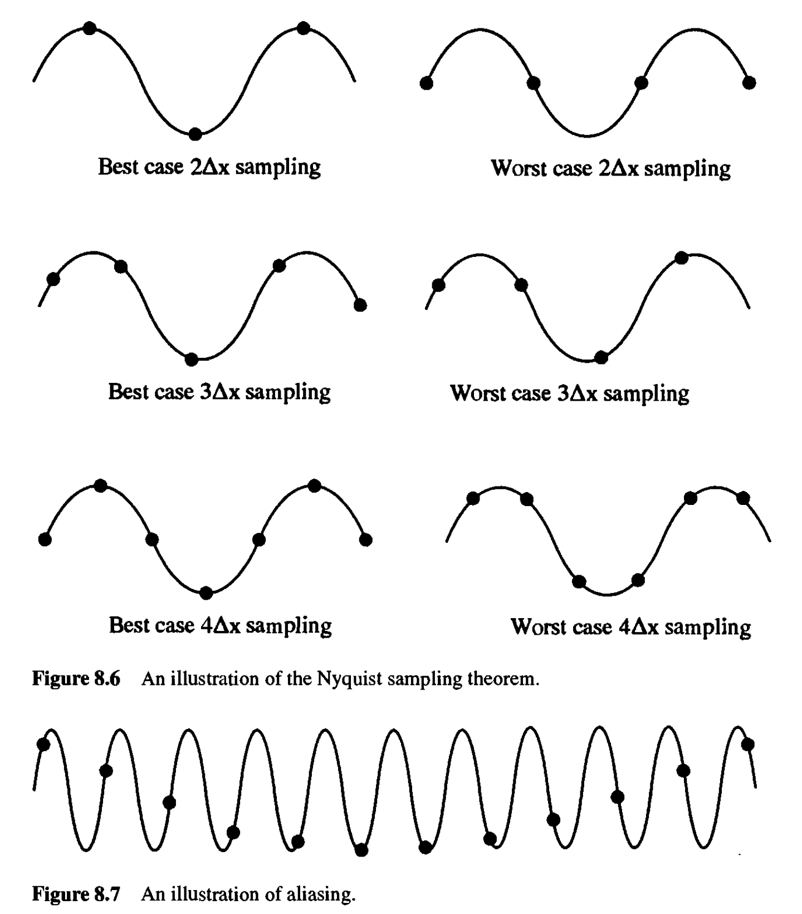

<!--
_header: Ref: Laney (1998)
-->

---
### 例：FTCSスキーム

FTCSスキームの差分式に$u^{n}_{i}$を代入して整理すると
$$
g = 1 - \frac{1}{2} \nu
\left( e^{j\theta} - e^{-j\theta} \right) = 1 - j \nu \sin \theta
$$
を得る．ここで$g = \tilde{u}^{n+1}/\tilde{u}^{n}$は複素増幅率などと呼ばれる．

もう少し分かり易くするために，$g = |g| e^{j\phi}$と書いておこう．ここで$|g|$は$u^{n}_{i}$から$u^{n+1}_{i}$へ数値解を時間発展させた際の振幅の絶対値の増幅率，$\phi$は位相差を現す．具体的に評価すると
$$
|g|^2 = 1 + \nu^2 \sin \theta, \quad \tan \phi =- \nu \sin\theta
$$
である．一方で厳密解については以下で与えられることが簡単に示せる．
$$
|g|^2 = 1, \quad \phi = -\nu \theta
$$

つまり，厳密解は振幅が増大も減衰もせず一定なのにも関わらず，FTCSスキームによって得られる数値解の振幅は$\nu$や$\theta$の値に関わらず(すなわち$\Delta t$や$\Delta x$によらず)常に指数関数的に増大する．
これはFTCSスキームが数値的に**無条件不安定**であることを意味する．

#### Q.3-2
線形移流方程式の厳密解では$|g|^2 = 1$および$\phi = - \nu\theta$となることを示せ．

---
### 位相誤差

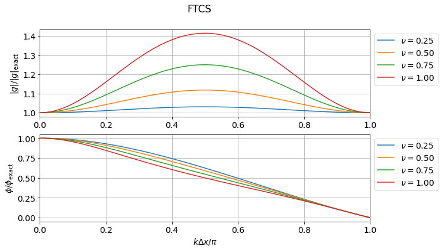

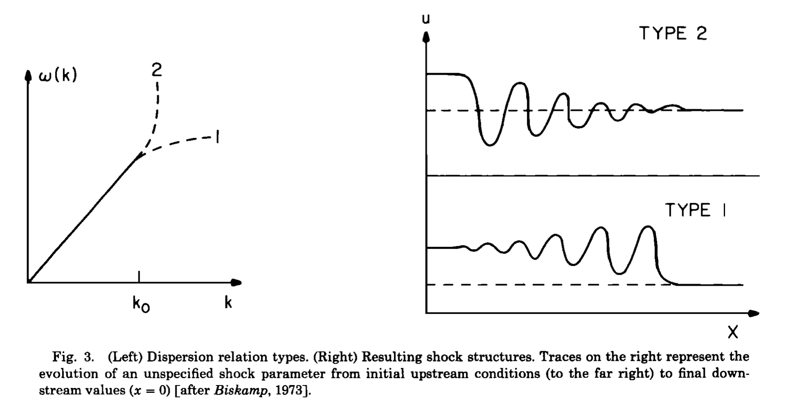

###
###
###
###
###
###
###
###
###

絶対値$|g|$は数値的な成長率（減衰率）を表すのに対して偏角$\phi$は数値的な位相速度を表す．一般に数値誤差は$\theta$依存性（波長依存性）を持つので，数値解は波長に依存して異なる位相速度を与えることになる．

<!--
_header: Ref: Mellott (1985)
-->

---
### 例：拡散方程式へのFTCSスキームの適用

放物型の偏微分方程式である拡散方程式
$$
\frac{\partial u}{\partial t} = D \frac{\partial^2 u}{\partial x^2}
$$
にも時間方向には前進差分，空間方向には中心差分をとったFTCSスキーム
$$
\frac{u^{n+1}_{i} - u^{n}_{i}}{\Delta t} =
D \frac{u^{n}_{i+1} - 2 u^{n}_{i} + u^{n}_{i-1}}{\Delta x^2}
$$
を考えてvon Neumannの安定性解析を適用すると
$$
g = 1 - 2 \mu (1 - \cos \theta)
$$
を得る．ただし $\mu = D \Delta t /\Delta x^2$ である．従って安定性の条件は$\mu \leq 1/2$で与えられる．すなわち，$\Delta x$を細かくするには$\Delta t \propto \Delta x^2$となるように$\Delta t$も小さくとらなければならないことが分かる．

#### Q.3-3
実際に上記の複素増幅率$g = 1 - 2 \mu (1 - \cos \theta)$で与えられることを示せ．

---
### 例：FTFSスキームおよびFTBSスキーム

移流方程式において，FTFS（空間方向に前進差分; Forward in Space）やFTBS（空間方向に後退差分; Backward in Space）を採用した場合はどうなるだろうか．
$$
\text{FTFS:} \,
u^{n+1}_{i} = u^{n}_{i} - \nu \left( u^{n}_{i+1} - u^{n}_{i} \right)
\quad
\text{FTBS:} \,
u^{n+1}_{i} = u^{n}_{i} - \nu \left( u^{n}_{i} - u^{n}_{i-1} \right)
$$
と書けるので，
$$
\text{FTFS:} \,
g = 1 + \nu \left[ (1 - \cos \theta) + j \sin \theta \right]
\quad
\text{FTBS:} \,
g = 1 - \nu \left[ (1 - \cos \theta) + j \sin \theta \right]
$$
となる．すなわち$c \rightarrow -c$（$\nu \rightarrow -\nu$）として流れの符号を反転させれば同じ結果が得られるので，どちらか一方だけを考えればよい．

ここではFTFSを考えると，安定性$|g| \leq 1$を満たすためには
$$
-1 \leq \nu \leq 0
$$
が必要なことが直ちに分かる．（同様にFTBSでは$0 \leq \nu \leq 1$が安定性の条件である．）

#### Q.3-4
FTFSの安定性条件が$-1 \leq \nu \leq 0$で与えられることを示せ．
（この結果よりFTBSの安定性条件も直ちに明らかである．）

---
## 3.4 風上差分法

移流方程式におけるFTFSおよびFTBSの安定性条件についてもう少し考えてみよう．例えばFTBSスキーム
$$
u^{n+1}_{i} = u^{n}_{i} - \nu \left( u^{n}_{i} - u^{n}_{i-1} \right)
$$
の安定性条件$0 \leq \nu \leq 1$の下限および上限は以下のように解釈することができる．

- $0 \leq \nu$ であれば$u_{i}$を更新する際に用いる点$x_{i}, x_{i-1}$が物理的な情報伝播の「風上」に対応する．
- $\nu \leq 1$ であれば$u_{i}$に情報を運ぶ「風上」の点が$x_{i}, x_{i-1}$の間に位置する．

一般に（特別に設計されたスキームを除き），系の最大情報伝播速度$c_{\rm max}$に対応したCourant数に対して
$$
\frac{c_{\rm max} \Delta t}{\Delta x} \leq 1
$$
が数値的安定性の必要条件（十分条件とは限らない！）となることが多い．
これを**CFL(Courant-Friedrichs-Lewy)条件**と呼ぶ．

- 非線形や多次元問題についての厳密な安定性解析が難しいが，経験上はこれよりも少し厳しい条件が安定性として課されることが多いようである．従って，これよりも小さなCourant数を採用することが常である．
- 上記の風上差分スキームは空間精度が1次精度であり実用的ではない．しかし，現代の高精度数値流体計算スキームの多くはこのような風上差分の考え方を基に設計されており，この考え方は極めて重要である．

---

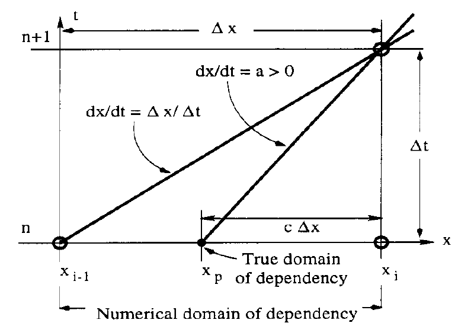

物理的にはCFL条件は1ステップの間に情報が伝播する距離が1グリッド以下であることを意味する．もし1ステップの間に情報が1グリッド以上風上の点から伝播してくるのであれば，隣のグリッドの情報しか用いないスキームは物理的に妥当とは言えないであろう．

<!--
_header: Ref: Toro (2009)
-->

---

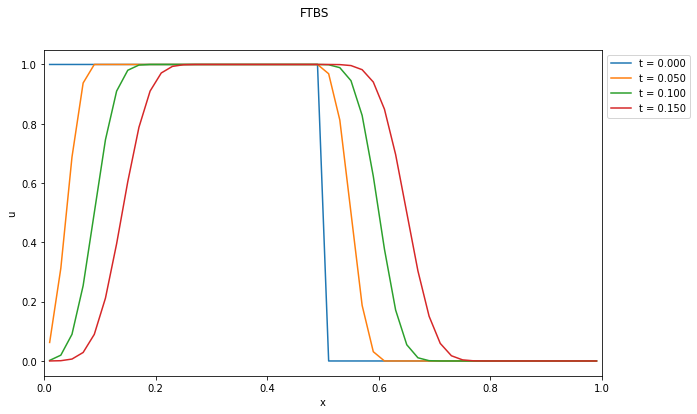

---
## 3.5 Lax-Friedrichsスキーム

移流方程式においては空間1次精度の風上差分は安定であり，FTCSスキームは空間2次精度であるにも関わらず不安定となる．実用的には2次精度以上のスキームが欲しくなるので，空間精度を向上させるためにもFTCSスキームについてもう少し考察してみよう．
打切り誤差の評価において時間微分を$\partial u/\partial t = - c \partial u/\partial x$を使って書き換えると
$$
\begin{aligned}
\frac{u^{n+1}_{i} - u^{n}_{i}}{\Delta t} + c \frac{u^{n}_{i+1} - u^{n}_{i-1}}{2 \Delta x}
&=
\left( \frac{\partial u}{\partial t} \right)^{n}_{i} +
c \left( \frac{\partial u}{\partial x} \right)^{n}_{i} +
c^2 \frac{\Delta t}{2} \left( \frac{\partial^2 u}{\partial x^2} \right)^{n}_{i}
+ \text{(higher orders)}
\end{aligned}
$$
となる．ここで誤差の最低次の$\mathcal{O}(\Delta t)$の項が実質的な逆拡散として作用するため，FTCSスキームが無条件不安定になると解釈できる．逆に考えれば，FTCSスキームに逆拡散を打ち消すような拡散効果を加えればスキームは安定化すると予想される．

ここでは$u^{n}_{i} \rightarrow (u^{n}_{i+1} + u^{n}_{i-1})/2$のような平均化操作を加えて，以下のように修正したスキームを考えよう．
$$
\begin{aligned}
\frac{u^{n+1}_{i} - (u^{n}_{i+1} + u^{n}_{i-1})/2}{\Delta t} +
c \frac{u^{n}_{i+1} - u^{n}_{i-1}}{2 \Delta x}
= 0
\end{aligned}
$$
これをLax-Friedrichsスキームと呼ぶ．

---

#### Q.3-5
Lax-Friedrichsスキームについてvon Neumannの安定性解析を行い，複素増幅率が
$$
g = \cos \theta - j \nu \sin \theta
$$
となることを示せ．これから直ちに$|\nu| \leq 1$のときにはこのスキームが安定となることが分かる．

#### Q.3-6
Lax-Friedrichsスキームについても同様にTaylor展開によって誤差評価を行うと
$$
\begin{aligned}
\frac{u^{n+1}_{i} - (u^{n}_{i+1} + u^{n}_{i-1})/2}{\Delta t} +
c \frac{u^{n}_{i+1} - u^{n}_{i-1}}{2 \Delta x}
&=
\left( \frac{\partial u}{\partial t} \right)^{n}_{i} +
c \left( \frac{\partial u}{\partial x} \right)^{n}_{i} -
\frac{\Delta x^2}{2 \Delta t} \left( 1- \nu^2 \right)
\left( \frac{\partial^2 u}{\partial x^2} \right)^{n}_{i} +
\text{(higher orders)}
\end{aligned}
$$
となることを示せ．これより$|\nu| \leq 1$のときには最低次の項が通常の拡散項として作用し，スキームは安定となる．ただしCFL条件より$c \Delta t \lesssim \Delta x$であることを考えれば，このスキームは空間1次精度でしかないことに注意せよ．

---

---
## 3.5 Lax-Wendroffスキーム

時間方向のTaylor展開に解析的な関係式$\partial u/\partial t = - c \partial u/\partial x$を代入すると
$$
\begin{aligned}
u^{n+1}_{i} &
= u^{n}_{i} +
\left( \frac{\partial u}{\partial t} \right)^{n}_{i} \Delta t +
\left( \frac{\partial^2 u}{\partial t^2} \right)^{n}_{i} \frac{1}{2} \Delta t^2 +
\mathcal{O} (\Delta t^3)
\\
&= u^{n}_{i} +
\left( \frac{\partial u}{\partial x} \right)^{n}_{i}
\left( c \Delta t \right) +
\left( \frac{\partial^2 u}{\partial x^2} \right)^{n}_{i}
\frac{1}{2} \left( c \Delta t^2 \right)^2 +
\mathcal{O} (\Delta t^3)
\end{aligned}
$$
ここで空間微分を2次精度中心差分で置き換えると
$$
u^{n+1}_{i} = u^{n}_{i} -
\frac{1}{2} \nu \left( u^{n}_{i+1} - u^{n}_{i-1} \right) +
\frac{1}{2} \nu^2 \left( u^{n}_{i+1} - 2 u^{n}_{i} + u^{n}_{i-1} \right)
$$
を得る．これをLax-Wendroffスキームと呼ぶ．

---

#### Q.3-7
Lax-Wendroffスキームについてvon Neumannの安定性解析を行い，複素増幅率が
$$
g = 1 - \nu^2 (1 - \cos \theta) - j \nu \sin \theta
$$
となることを示せ．このときも$|\nu| \leq 1$が安定性の条件となる．

#### Q.3-8
Lax-Wendroffスキームの誤差評価を行い，以下の式を示せ．
$$
\begin{aligned}
& \frac{u^{n+1}_{i} - u^{n}_{i}}{\Delta t} +
c \frac{u^{n}_{i+1} - u^{n}_{i-1}}{2 \Delta x} -
\frac{c^2 \Delta t}{2}
\frac{u^{n}_{i+1} - 2 u^{n}_{i} + u^{n}_{i-1}}{\Delta x^2}
\\
& =
\left( \frac{\partial u}{\partial t} \right)^{n}_{i} +
c \left( \frac{\partial u}{\partial x} \right)^{n}_{i} +
\mathcal{O(\Delta t \Delta x)} +
\mathcal{O(\Delta t^2)} +
\mathcal{O(\Delta x^2)}
\end{aligned}
$$
CFL条件より$c \Delta t \lesssim \Delta x$であるから，このスキームの精度は時間・空間ともに2次精度となることが分かる．

---

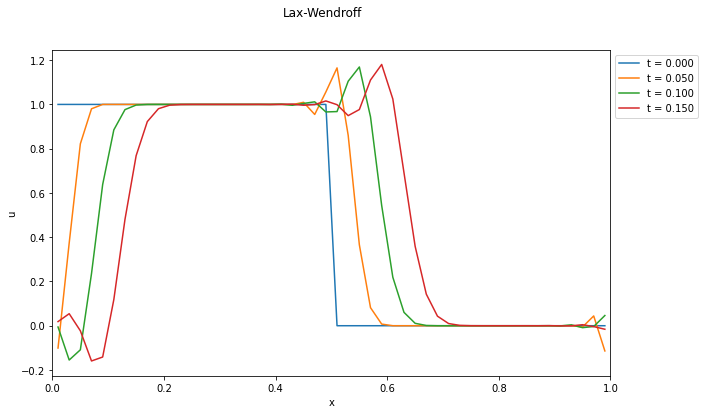

---
## 3.6 線形波動方程式

等温の状態方程式$p = \rho R T = \rho C_s^2$を採用した1次元のEuler方程式（流体方程式）は以下のように書ける．
$$
\begin{aligned}
& \frac{\partial}{\partial t} \rho +
\frac{\partial}{\partial x} \left( \rho v \right) = 0,
\\
& \rho \left(
  \frac{\partial}{\partial t} v +
  v \frac{\partial}{\partial x} v
\right) = -
\frac{\partial}{\partial x} p = -
C_s^2 \frac{\partial}{\partial x} \rho.
\end{aligned}
$$
ここで$C_s = \sqrt{p/\rho}$は音速である．平衡状態$\rho = \rho_0, v = 0$に対する摂動$\delta \rho, \delta v$を考えて線形化（摂動の2次以上の項を無視）すると

$$
\begin{cases}
\displaystyle
\frac{\partial f}{\partial t} + C_s \frac{\partial g}{\partial x} = 0
\\
\displaystyle
\frac{\partial g}{\partial t} + C_s \frac{\partial f}{\partial x} = 0
\end{cases}
$$
または線形波動方程式
$$
\frac{\partial^2 f}{\partial t^2} + C_s^2 \frac{\partial^2 f}{\partial x^2} = 0
$$
を得る．ただし$f = \delta \rho/\rho_0, g = \delta v/C_s$と置いた．

---
波動方程式を書き換えると
$$
\frac{\partial}{\partial t} (f \pm g) \pm C_s
\frac{\partial}{\partial x} (f \pm g) = 0
$$
と書ける．すなわち波動方程式の解は$u = f \pm g$に対する速度$c = \pm C_s$の線形移流方程式の解の線形結合から得られる．

#### Q.3-9
等温の状態方程式を用いた1次元Euelr方程式を線形化し，実際に上記の（連立）線形移流方程式が得られることを示せ．

---
## 3.7 保存形式

多くの物理的に興味ある双曲型偏微分方程式は以下のような保存形（双極型保存則）で書かれる．
$$
\frac{\partial}{\partial t} \bm{u} +
\frac{\partial}{\partial x} \bm{f}(\bm{u}) = 0.
$$
ここで$\bm{u} = u_1, u_2, \ldots$は独立変数，$\bm{f} (\bm{u}) = f_1(\bm{u}), f_2(\bm{u}), \ldots$は流束関数である．独立変数$\bm{u}$が境界条件の影響を除いて保存量となることは簡単に示すことができる．

これまで考えてきた線形移流方程式や流体力学のEuler方程式もこの形式で書き下せる．Euler方程式においては質量，運動量，エネルギーなどの保存量が$\bm{u}$に対応する．

#### Q.3-10
保存形で書かれた上式において$\displaystyle \int \bm{u} dx$ が境界条件の影響を除いて保存することを示せ．

#### Q.3-11
線形移流方程式を保存形で書き表し，流束関数$f(u)$の表式を求めよ．

---

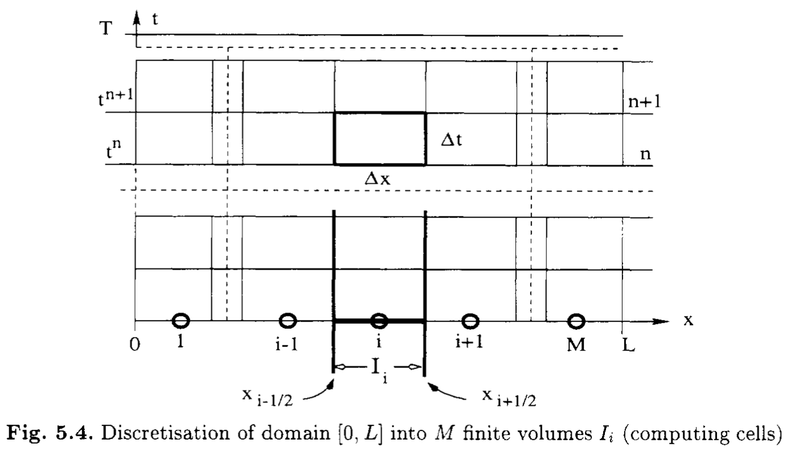

保存すべき量を正しく保存させるような数値計算スキームを保存形スキームと呼ぶ．これは元の微分形ではなく，積分形で評価することによって得られる．具体的には図に示す領域 $[t^{n}, t^{n+1}] \times [x_{i-1/2}, x_{i+1/2}]$ で積分する．
$$
\frac{1}{\Delta t \Delta x}
\int_{t^{n}}^{t^{n+1}} dt \int_{x_{i-1/2}}^{x_{i+1/2}} dx
\left[
  \frac{\partial}{\partial t} \bm{u} + \frac{\partial}{\partial x} \bm{f}
\right] = 0
$$

<!--
_header: Ref: Toro (2009)
-->

---

積分形を離散化表現に直すと
$$
\frac{\bar{\bm{u}}^{n+1}_{i} - \bar{\bm{u}}^{n}_{i}}{\Delta t} +
\frac{\hat{\bm{f}}_{i+1/2} - \hat{\bm{f}}_{i-1/2}}{\Delta x} = 0
$$
を得る．ここでセル平均値$\bar{\bm{u}}_{i}$および数値流束$\hat{\bm{f}}^{i+1/2}$は以下で定義される．
$$
\bar{\bm{u}}^{n}_{i} = \frac{1}{\Delta x}
\int_{x_{i-1/2}}^{x+1/2} \bm{u}(x,t^n) dx
\quad \quad
\hat{\bm{f}}_{i+1/2} = \frac{1}{\Delta t}
\int_{t^{n}}^{t^{n+1}} \bm{f}(\bm{u}(x_{i+1/2}, t)) dt
$$
この形式で書いておけば数値流束としてどんな近似をとったとしても，厳密に（丸め誤差などの計算機の誤差の範囲内で）保存則を満たす．そのため，この形式を**保存形式**と呼ぶ．

なお，厳密にはこれは**有限体積法**に分類される手法であり，特に圧縮性流体力学の数値解法としてよく用いられる．ただし，簡単に分かるように$\bar{\bm{u}}_{i} = \bm{u}_{i} + \mathcal{O} (\Delta x^2)$であり，2次精度以下ではこれまで扱ってきた有限差分法と有限体積法の差はほとんどない．この講義では3次精度以上のスキームは扱わないので，以下では$\bar{\bm{u}}_{i} \approx \bm{u}_{i}$として両者を区別せずに用いる．

#### Q.3-12
保存形式のスキームであれば境界条件の影響を除いて保存則を厳密に満たすことを示せ．

---
これまで線形移流方程式($f(u) = cu$)について考えてきたスキームは以下のように保存形式で書くことができる．

### FTCSスキーム
$$
\hat{f}_{i+1/2} =
\frac{1}{2} \left( f_{i} + f_{i+1} \right)
$$

### 1次精度風上差分スキーム
$$
\hat{f}_{i+1/2} =
\frac{1}{2} \left( f_{i} + f_{i+1} \right) -
\frac{|c|}{2} \left( u_{i+1} - u_{i} \right)
$$

### Lax-Friedrichsスキーム
$$
\hat{f}_{i+1/2} =
\frac{1}{2} \left( f_{i} + f_{i+1} \right) -
\frac{\Delta x}{2 \Delta t} \left( u_{i+1} - u_{i} \right)
$$

### Lax-Wendroffスキーム
$$
\hat{f}_{i+1/2} =
\frac{1}{2} \left( f_{i} + f_{i+1} \right) -
\frac{c^2 \Delta t}{2 \Delta x}  \left( u_{i+1} - u_{i} \right)
$$

---
よく用いられる保存形スキームは
$$
\hat{f}_{i+1/2} =
\frac{\alpha f_{i} + \beta f_{i+1}}{\alpha + \beta} -
\gamma (u_{i+1} -u_{i})
$$
の形で書けることが多い．ここで第1項は$f_{i}$と$f_{i+1}$の何らかの平均，第2項は$\hat{f}_{i+1/2} - \hat{f}_{i-1/2}$の形にしたときに数値拡散項として働くことが分かる．

数値流束の評価は第1項だけでできるのが理想であるが，FTCSスキーム($\gamma = 0$)が数値的に不安定であるように，この項だけでは不安定になりやすい．そこで第2項を加えてスキームを安定化させていると考えることができる．

#### Q.3-13
各スキームに含まれる拡散項の大きさを比較せよ．

---
## 3.8 Godunovの定理
線形移流方程式に対して，以下の形の線形スキームを考えよう．
$$
u^{n+1}_{i} = \sum_{k} c_k u^{n}_{i+k}
$$
このとき，2次以上の精度を持ついかなるスキームも単調性を維持することができない．これを**Godunovの定理**と呼ぶ．

単調正を維持できないということは数値振動が避けられないことを意味する．実用上は2次精度以上はほぼ必須であることを考えると，スキームに何らかの非線形性を導入することが必要になってくる．単調性が崩れるのは不連続面など急峻な勾配が存在する場合であることを考えると，例えば

1. 滑らかな領域では高次精度を用い，急勾配が存在する領域では数値拡散を強くする
1. 急勾配が存在する領域を上手く避けるステンシルを選ぶ

などによってできるだけ単調正を維持するようなスキームを設計することが多い．いずれにせよ数値拡散項（$\gamma$）の選び方が鍵になる．

---
## 3.9 人工粘性
数値振動を抑えながら安定に急峻な解を扱うための古典的な手法として，人工粘性が挙げられる．例えば，時間・空間2次精度のLax-Wendroffスキームをベースとし，急勾配がある領域にだけ人工的に大きな数値拡散項を加えて精度を局所的に1次精度に落とし，数値振動を防ぐ．この数値拡散項をうまく解の勾配等によって決定すればスキームを非線形となり，Godunovの定理の前提条件である線形性を回避することができる．

ここでは最も簡単なモデルとして，
$$
\kappa = \varepsilon
\lvert u^{n}_{i+1} - 2 u^{n}_{i} + u^{n}_{i-1} \rvert
$$
によって決定する拡散項をLax-Wendroff法に付加したスキームを考えよう．
$$
u^{n+1}_{i} = u^{n}_{i} -
\frac{1}{2} \nu \left( u^{n}_{i+1} - u^{n}_{i-1} \right) +
\left( \frac{1}{2} \nu^2 + \kappa \right)
\left( u^{n}_{i+1} - 2 u^{n}_{i} + u^{n}_{i-1} \right)
$$
ここで，$\varepsilon$は経験的に決められる定数である．このとき，数値拡散項$\kappa$は$|\partial^2 u/\partial x^2|$に比例して大きくなるように選ばれていることが分かる．

- スカラー方程式以外の場合についても，何らかの基準で決めた拡散項を追加することで局所的に拡散を強くし，数値振動を抑えた滑らかな解を実現することを狙う．
- 流体力学における粘性は速度の空間2階微分であるが，数値拡散は物理的な粘性項ではないので，これにはこだわらない．
- 通常の拡散項（2階微分）では拡散が強く効きすぎるので，4階微分や6階微分などの高階微分項を数値的に導入し，より短い波長の振動のみを効果的に減衰させることも多い．これはhyper viscosityと呼ばれる．

---

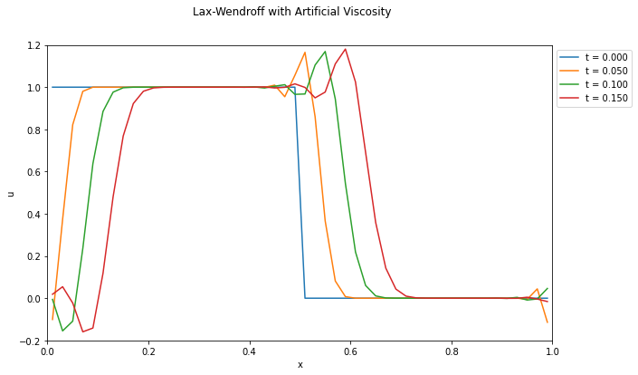

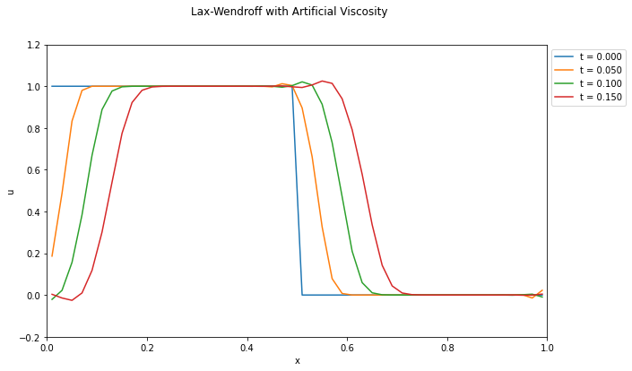

####
####
####
####
####
####
####
####
####
####

オリジナルのLax-Wendroffスキーム（左）と，$\epsilon = 0.2$とした人工粘性入りLax-Wendroffスキーム（右）の比較．数値振動が抑えられていることが分かる．ただし，一般に必要な人工粘性の強さは経験的に決められるもので，また必要な粘性の強さは問題に依存する．

※ 近年はこのような職人芸的な人工粘性の選び方をせずとも，数値振動を抑えつつ急峻な勾配を捉えられる手法を使うのがトレンドである．人工粘性のファインチューニングにいそしむよりも，より現代的なスキームの勉強をしよう．

---
## 3.10 2段階Lax-Wendroffスキーム

Lax-Wendroffスキームは基礎方程式を使ってTaylor展開の時間微分を空間微分に置き換えるスキームであったが，これは一般の方程式の扱いには不便なのでもう少し扱いやすくしたい．一般の保存形数値解法
$$
\begin{aligned}
\frac{\bar{\bm{u}}^{n+1}_{i} - \bar{\bm{u}}^{n}_{i}}{\Delta t} +
\frac{\hat{\bm{f}}_{i+1/2} - \hat{\bm{f}}_{i-1/2}}{\Delta x} = 0
\end{aligned}
$$
において
$$
\begin{aligned}
& \bm{u}^{n+1/2}_{i+1/2} =
\frac{1}{2} \left( u^{n}_{i} + u^{n}_{i+1} \right) -
\frac{\Delta t}{2 \Delta x}
\left( f(\bm{u}^{n}_{i+1}) - f(\bm{u}^{n}_{i}) \right)
\\
& \hat{\bm{f}}_{i+1/2} = \frac{1}{\Delta t}
\int_{t^{n}}^{t^{n+1}} \bm{f}(\bm{u}(x_{i+1/2}, t)) dt
\approx
\hat{\bm{f}}(\bm{u}^{n+1/2}_{i+1/2})
\end{aligned}
$$
と近似しよう．これを2段階Lax-Wendroffスキームと呼ぶ．このスキームであれば方程式の具体的形に依存せず適用することが可能である．

#### Q.3-14
線形移流方程式については2段階Lax-WendroffスキームとオリジナルのLax-Wendroffスキームが一致することを示せ．

---
人工粘性を加えるには数値流束に拡散的になる項を付け加えればよい．例えば
$$
\hat{\bm{f}}_{i+1/2} =
\hat{\bm{f}}(\bm{u}^{n+1/2}_{i+1/2})
- \kappa \frac{\Delta x}{\Delta t} (u^{n}_{i+1} - u^{n}_{i})
$$
のように修正すれば右辺第2項が拡散項として働くことが確かめられる．人工粘性は局所的な勾配が大きいところで強くなるようにしたいので，例えば定数$\varepsilon$を用いて
$$
\kappa = \varepsilon |u^{n}_{i+1} - u^{n}_{i}|
$$
のように決めればよい．
