<!--
_class: title
-->

$$
\renewcommand{\bm}[1]{{\mathit{\boldsymbol{#1}}}}
$$

<!--
_class: title
-->

# 4. 双曲型偏微分方程式の解法 (2)：非線形問題

#### 参考文献
- 藤井孝蔵. (1994). 流体力学の数値計算法. 東京大学出版会.
- LeVeque, R. J. (1990). Numerical Methods for Conservation Laws. Numerical Methods for Conservation Laws. Basel: Springer Berlin Heidelberg. https://doi.org/10.1007/978-3-0348-5116-9
- Laney, C. B. (1998). Computational Gasdynamics. Cambridge University Press. https://doi.org/10.1017/CBO9780511605604
- Toro, E. F. (2009). Riemann Solvers and Numerical Methods for Fluid Dynamics. Riemann Solvers and Numerical Methods for Fluid Dynamics: A Practical Introduction. Berlin, Heidelberg: Springer Berlin Heidelberg. https://doi.org/10.1007/b79761

---
## 4.1 Burgers方程式
非線形の偏微分方程式として以下のBurgers方程式を考えよう．
$$
\frac{\partial u}{\partial t} + u \frac{\partial u}{\partial x} =
\alpha \frac{\partial^2 u}{\partial x^2}
$$
ここで$\alpha$は粘性項（拡散項）であり，$\alpha = 0$であればこの方程式は双曲型偏微分方程式に分類される．線形移流方程式と異なり移流速度が$u$に依存する形になっている．例えば流体力学における音波の位相速度は振幅に依存し，有限振幅の音波は有限時間で衝撃波に発展する．Burgers方程式はこれを簡単化したものと考えることができる．

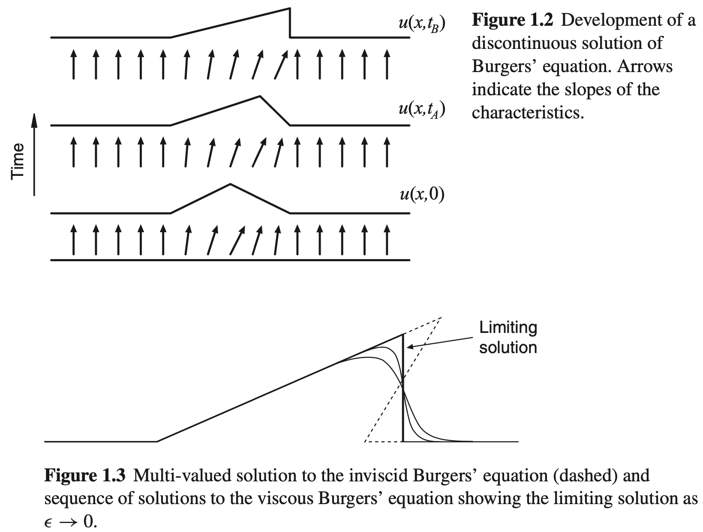

<!--
_header: Ref: Burgess & Scholer (Collisionless Shocks in Space Plasmas)
-->

---
### 特性曲線
一般に
$$
\frac{\partial u}{\partial t} + \lambda (u) \frac{\partial u}{\partial x} = 0
$$
と書けるとき，$\lambda(u)$を特性速度と呼ぶ．特性速度によって定義される
$$
\frac{d x}{d t} = \lambda(u)
$$
を特性曲線と呼ぶ．特性曲線に沿って物理量$u$が保存することは簡単に示すことができる．特性曲線に沿って一定となる量は特性量やRiemann不変量などと呼ばれる．
線形移流方程式では$\lambda(u) = c$で一定であるため，異なる特性曲線が交わることはない．一方でBurgers方程式では$\lambda(u) = u$であるため，一般には有限時間で異なる特性曲線が交わることになる．このとき数学的に一意な解が存在しない．数学的には有限の粘性$\alpha \neq 0$があれば，それが局所的に散逸として働き不連続な**衝撃波**が形成する．

#### Q.4-1
特性曲線に沿った物理量$u$の微分をとることによって，特性曲線に沿って$u$が保存することを示せ．
$$
\frac{d}{d t} = \frac{\partial}{\partial t} +
\frac{d x}{d t} \frac{\partial}{\partial x}
$$
を用いればよい．

---
### 衝撃波解

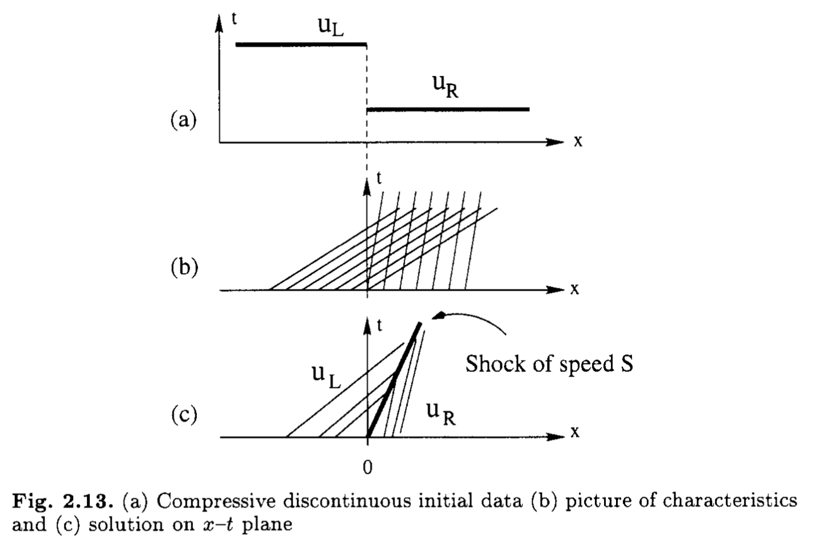
<!--
_header: Ref: Toro (2009)
-->

---
初期条件
$$
u(x, t=0) =
\begin{cases}
u_{L} \quad x < 0 \\
u_{R} \quad x > 0
\end{cases}
$$
が与えられたとき，積分形式
$$
\int_{x_1}^{x_2} dx
\left(
  \frac{\partial u}{\partial t} + \frac{\partial f(u)}{\partial x}
\right) = 0
$$
を考えると衝撃波の伝播速度$S$は以下の式で与えられる．
$$
S = \frac{f(u_{R}) - f(u_{L})}{u_{R} - u_{L}}
$$
非粘性のBurgers方程式($\alpha = 0$, $f(u) = u^2/2$)について考えると，$S = (u_{\rm R} + u_{\rm L})/2$となることがすぐに分かる．

このように微分方程式の解のうち，滑らかな領域で微分形を満足し，不連続な領域も含めて至るところで積分形を満足する解を弱解（weak solution）と呼ぶ．

#### Q.4-2
上記の積分形式において$x_1 < x < St$では$u = u_{L}$, $St < x < x_2$では$u = u_{R}$であることを用いて，衝撃波の伝播速度$S$を求めよ．ただし積分区間$[x_1, x_2]$は（この区間に衝撃波を含むよう十分大きくとれば）任意である．

---
### 膨張波解

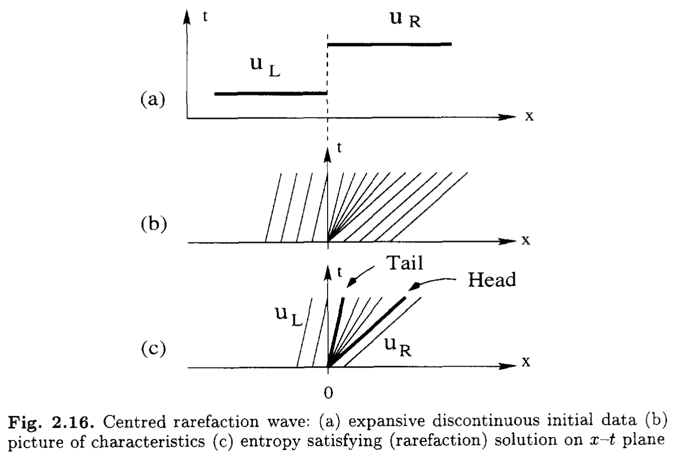

<!--
_header: Ref: Toro (2009)
-->

---
### 膨張衝撃波解（非物理的）

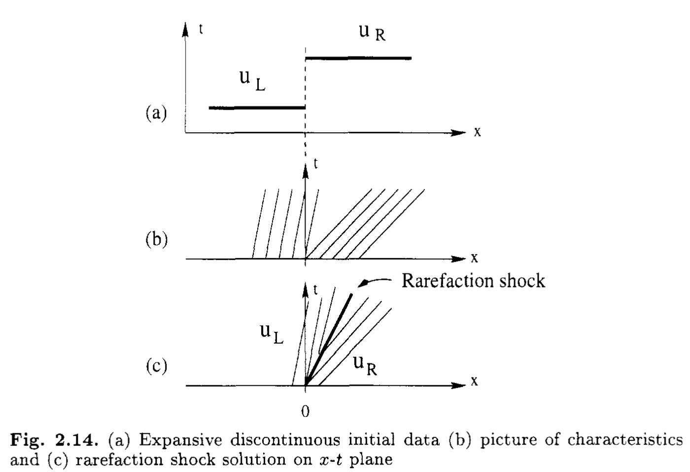

<!--
_header: Ref: Toro (2009)
-->

---
### 1次精度風上差分法

簡単のため$u > 0$および$\alpha = 0$を仮定しよう．このとき風上差分でも以下の3通りが考えられる．
$$
\begin{align}
\frac{u^{n+1}_{i} - u^{n}_{i}}{\Delta t} &+
\frac{u^{n}_{i} + u^{n}_{i-1}}{2} \frac{u^{n}_{i} - u^{n}_{i-1}}{\Delta x}
= 0 \tag{A} \\
\frac{u^{n+1}_{i} - u^{n}_{i}}{\Delta t} &+
u^{n}_{i} \frac{u^{n}_{i} - u^{n}_{i-1}}{\Delta x}
= 0 \tag{B} \\
\frac{u^{n+1}_{i} - u^{n}_{i}}{\Delta t} &+
u^{n}_{i-1} \frac{u^{n}_{i} - u^{n}_{i-1}}{\Delta x}
= 0 \tag{C} \\
\end{align}
$$

スキーム(A)は
$$
\frac{u^{n+1}_{i} - u^{n}_{i}}{\Delta t} +
\frac{\hat{f}_{i+1/2} - \hat{f}_{i-1/2}}{\Delta x} = 0
$$
のように保存形に書き直すことができる．ここで
$$
\hat{f}_{i+1/2} = \frac{(u^{n}_{i})^2}{2}
$$
が数値流速である．一方でスキーム(B)(C)は保存形で書くことはできない．

---

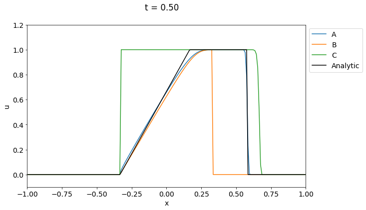

- (A): 衝撃波も膨張波も正しく捉えられている．
- (B): 衝撃波が動いていない
- (C): 衝撃波速度が正しくない．膨張波もできていない．

---
### Burgers方程式の数値解についての考察

- 物理的な解はエントロピー条件を満たさなければならない．衝撃波について考えると，エントロピー条件は
  $$
  u_{L} \leq S \leq u_{R}
  $$
  と表すことができる．これは衝撃波を介して圧縮が起こることを要請する．膨張衝撃波はこの条件を満たさないので物理的な解とはみなされない．

- Lax-Wendroffの定理：保存形の数値計算スキームを考えるとき，数値解が収束するならば，元の微分方程式の弱解に収束する．（ただし膨張衝撃波も弱解の1つなので，収束する解が物理的な解とは限らないことに注意が必要である．）
  非保存形のスキームは一般に衝撃波速度を正しく与えない．したがって，衝撃波（やそれに類する不連続面）が重要になる問題では保存形スキームがほぼ必須となっている．

---
### 滑らかな初期条件の場合

2段階Lax-Wendroffスキームは非線形問題にも適用できるようにオリジナルのLax-Wendroffスキームを改良したものである．実際にこれを用いてBurgers方程式を解いてみよう．具体的には
$$
\begin{aligned}
& u_{i+1/2} = \frac{u_{i} + u_{i+1}}{2} - \frac{\Delta t}{2 \Delta x}
\left( f_{i+1} - f_{i} \right)
\\
& \hat{f}_{i+1/2} = \frac{(u_{i+1/2})^2}{2} -
\kappa_{i+1/2} \frac{\Delta x}{\Delta t} (u_{i+1} - u_{i}) -
\alpha \frac{u_{i+1} - u_{i}}{\Delta x}
\end{aligned}
$$
のように求めた数値流速を用いて解を更新すればよい．
ここで
$$
\kappa_{i+1/2} = \varepsilon |u_{i+1} - u_{i}|
$$
とし，定数$\varepsilon \sim 0.1$で人工粘性の強さをコントロールする．

---

---
## 4.2 Euler方程式
Euler方程式（圧縮性流体力学の支配方程式）は質量・運動量・エネルギー保存則から次のように書き表される．
$$
\frac{\partial}{\partial t}
\begin{pmatrix}
\rho \\
\rho v \\
\varepsilon
\end{pmatrix} +
\frac{\partial}{\partial x}
\begin{pmatrix}
\rho v \\
\rho v^2 + p \\
(\varepsilon + p) v
\end{pmatrix} = 0
$$
ここで
$$
\varepsilon = \frac{1}{2} \rho v^2 + \frac{p}{\gamma-1}
$$
は流体の全エネルギー密度，$\gamma$は比熱比である．

Euler方程式は非線形連立双曲型保存則(System of Nonlinear Hyperbolic Conservation Laws)の実用的に重要な例の一つである．ここで$\bm{u} = (\rho, \rho v, \varepsilon)$の方程式はそれぞれ質量保存則，運動量保存則，エネルギー保存則を表す．

---
#### Q.4-3
一様で静止した流体を平衡状態とし，これに対する微小摂動を考えることにより音波の分散関係$\omega^2 = k^2 C_s^2$が得られることを示せ．ただし，$C_s = \sqrt{\gamma p_0/\rho_0}$は音速である．

#### Q.4-4
Euler方程式のエネルギー保存則を書き換えると断熱の条件（流体素片の運動に沿ってエントロピーが一定）
$$
\frac{d}{dt} \left( \frac{p}{\rho^{\gamma}} \right) = 0
$$
が得られる．このことを示せ．

#### Q.4-5
Euler方程式の固有モードには，音波以外にエントロピー波と呼ばれるモードが存在する．これは密度は非一様で圧力が一定（すなわちエントロピーが非一様）の構造が流体に流されているものと考えることができる．具体的に$v = v_0 = const$, $p = p_0 = const$の条件のとき，
$$
\frac{d}{dt} \rho = 0
$$
であればEuler方程式が満たされることを示せ．

---
### 有限振幅の音波
簡単のためエントロピー$S = p/\rho^\gamma$が一定と仮定しよう．Euler方程式を書き直すと以下の2式が得られる．
$$
\begin{aligned}
& \frac{\partial \rho}{\partial t}
+ \rho \frac{\partial v}{\partial x}
+ v \frac{\partial \rho}{\partial x} = 0,
\\
& \frac{\partial v}{\partial t}
+ v \frac{\partial v}{\partial x}
+ \frac{C_s^2}{\rho} \frac{\partial \rho}{\partial x} = 0.
\end{aligned}
$$
ここで$C_s^2 = \gamma p/\rho \propto \rho^{\gamma-1}$は定数でないことに注意．さらに$\rho$を$C_s$で書き換えると
$$
%\begin{aligned}
\frac{\partial}{\partial t}
\left(
	v \pm \frac{2 C_s}{\gamma-1}
\right) +
\left( v \pm C_s \right)
\frac{\partial}{\partial x}
\left(
	v \pm \frac{2 C_s}{\gamma-1}
\right)
= 0, \tag{A}
%\end{aligned}
$$
となり，$J_{\pm} = v \pm 2 C_s/(\gamma-1)$が以下で定義される特性曲線に沿って一定となる（すなわちRiemann不変量である）ことが分かる．
$$
\frac{dx}{dt} = \lambda_{\pm} = v \pm C_s.
$$

#### Q.4-6
式(A)を示せ．

---

<!--
_header: Ref: Laney (1998)
-->

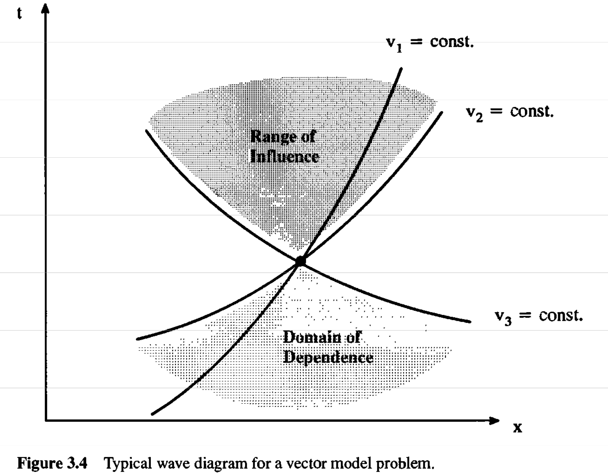

- 変数の個数の分だけ特性曲線および対応する不変量が存在する．
- 異なる不変量に関する特性曲線は互いに交わる．
- 微分方程式の解の一意性のため，一つの不変量に関する特性曲線は交わることはない．交わる場合は衝撃波（不連続面）が存在しなければならない．

---
### 音波の伝播と急峻化

---
## 4.3 Riemann問題

#### Sodの衝撃波管問題

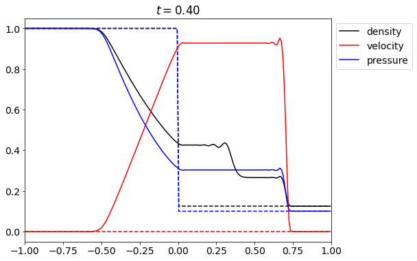

---
一般に保存則
$$
\frac{\partial \bm{u}}{\partial t} +
\frac{\partial \bm{f}(\bm{u})}{\partial x} = 0
$$
において初期条件
$$
\bm{u}(x, t=0) =
\begin{cases}
\bm{u}_{L} \quad x < 0 \\
\bm{u}_{R} \quad x > 0
\end{cases}
$$
が与えられたときの時間発展を求める問題をRiemann問題と呼ぶ．このとき固有値の数（すなわち変数の数）の分だけ$x = 0$から「波」が発生する．この「波」の影響がおよぶ領域をRiemann fanと呼ぶ．

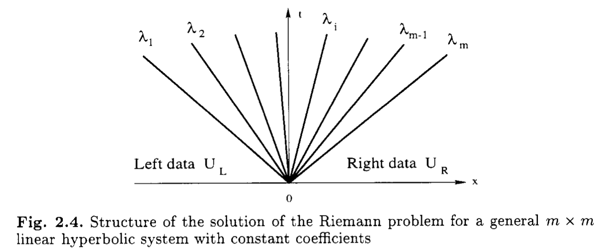

<!--
_header: Ref: Toro (2009)
-->

---

保存則を変形して
$$
\begin{aligned}
\frac{\partial \bm{u}}{\partial t} +
\frac{\partial \bm{f}(\bm{u})}{\partial x} = 0
\rightarrow
\frac{\partial \bm{u}}{\partial t} +
\frac{\partial \bm{f}}{\partial \bm{u}} \cdot \frac{\partial \bm{u}}{\partial x} =
\frac{\partial \bm{u}}{\partial t} +
\bm{A} \cdot \frac{\partial \bm{u}}{\partial x} =
0
\end{aligned}
$$
と書いておこう．ここで$A_{ij} = \partial f_{i}/\partial u_{j}$はこの系のJacobianである．このJacobianの固有値$\lambda_{i}$および固有ベクトル$\bm{r}_{i}$を
$$
\bm{A} \bm{r}_{i} = \lambda_{i} \bm{r}_{i}
\quad (i=1, 2, \ldots, n)
$$
によって定義する．固有ベクトルを並べた行列$\bm{R} = (\bm{r}_1, \bm{r}_2, \ldots, \bm{r}_{n})$を用いると，Jacobianを対角化できる．
$$
\bm{\Lambda} = \bm{R}^{-1} \bm{A} \bm{R} =
\text{diag} (\lambda_1, \lambda_2, \ldots, \lambda_n)
$$
さらに変数変換$d \bm{v} \equiv \bm{R}^{-1} d \bm{u}$を用いると，元の方程式は$n$個の独立な線形移流方程式
$$
\frac{\partial v_{i}}{\partial t} +
\lambda_{i}
\frac{\partial v_{i}}{\partial x} = 0
$$
に書き直すことができる．ここで固有値$\lambda_i$は$v_i$の伝播速度（特性速度）を表しており，明らかに$v_i$は特性量（Riemann不変量）である．

####

- 実際にはEuler方程式は非線形なので$\lambda_i$も$\bm{u}$の関数であるが，定性的な性質は変わらない．
- 一般に独立変数が$n$個ある方程式系では固有値・固有ベクトル（すなわち波動モードの数）も$n$個ある．全ての固有値が正（$\lambda_i > 0$）の方程式系は双曲型保存則と呼ばれる．

---
### 応用例1

---
### 応用例2
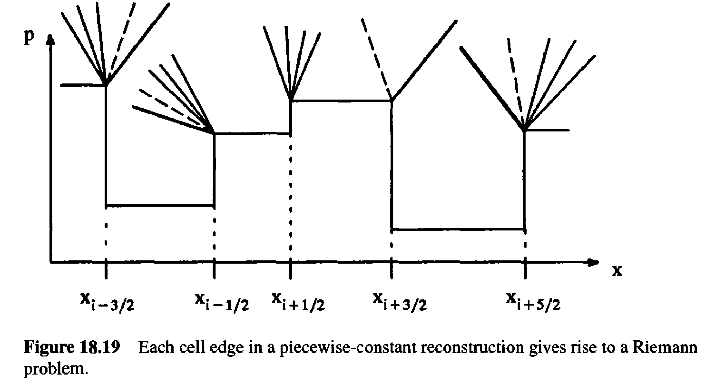

圧縮性流体力学では一般に不連続な解が発生するため，セル境界における解の連続性を要請しないスキームが好まれる．セル境界での数値流束$\hat{\bm{f}}_{i+1/2}$が決められれば
$$
\frac{\bm{u}^{n+1}_{i} - \bm{u}^{n}_{i}}{\Delta t} +
\frac{\hat{\bm{f}}_{i+1/2} - \hat{\bm{f}}_{i-1/2}}{\Delta x} = 0
$$
から解を更新することができる．ここで各セル境界においてRiemann問題の近似解を使って数値流束を決定するのが一般的な手法である．（Riemann問題の完全な解が必要なわけではなく，あくまでセル境界における数値流束だけが必要なことに注意．）

<!--
_header: Ref: Laney (1998)
-->

---
## 4.4 線形化されたRiemann解法

### 線形Riemann問題
線形Riemann問題ではJacobian$\bm{A}$が$\bm{u}$に依存しない．したがって，対角化の結果は時間・空間によらず常に同じ結果となる．特性量に書き換えたRiemann問題は
$$
\bm{v}(x, t=0) =
\begin{cases}
\bm{v}_{L} = \bm{R}^{-1} \bm{u}_{L} \quad x < 0
\\
\bm{v}_{R} = \bm{R}^{-1} \bm{u}_{R} \quad x > 0
\end{cases}
$$
となる．各特性量に関する線形移流方程式は互いに独立なので，線形Riemann問題の解はトリビアルに決まる．例えば独立変数の数が$n = 3$のときの解は下図の通り．

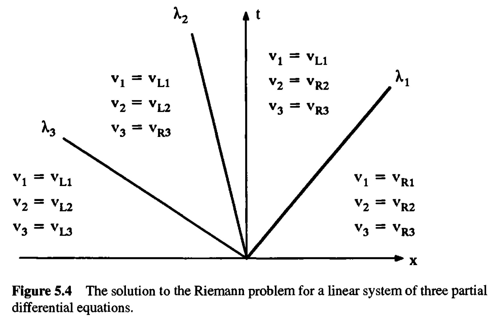

<!--
_header: Ref: Laney (1998)
-->

---
#### Q.4-7

簡単な例として線形化されたEuler方程式
$$
\begin{aligned}
& \frac{\partial \rho}{\partial t} +
\rho_0 \frac{\partial v}{\partial x} = 0,
\\
& \frac{\partial v}{\partial t} +
\frac{C_s^2}{\rho_0} \frac{\partial \rho}{\partial x} = 0
\end{aligned}
$$
を考えよう．このときのJacobianおよび固有値，固有ベクトルは以下の通りである．
$$
\begin{aligned}
A =
\begin{pmatrix} 0 & \rho \\ C_s^2/\rho & 0 \end{pmatrix}
\end{aligned}
\quad
\rightarrow
\quad
\lambda_{\pm} = \pm C_s,
\bm{r}_{\pm} =
\begin{pmatrix}
\rho \\ \mp C_s
\end{pmatrix}
$$
これらを用いると，初期の左状態を$(\rho_L, v_L)$，右状態を$(\rho_R, v_R)$とするRiemann問題の解が
$$
(\rho, v) =
\begin{cases}
(\rho_L, v_L) \quad & x < -C_s t \\
\displaystyle
\left(
\frac{\rho_L + \rho_R}{2} + \frac{\rho_0}{C_s} \frac{v_L - v_R}{2},
\frac{v_L + v_R}{2} + \frac{C_s}{\rho_0} \frac{\rho_R - \rho_L}{2},
\right)   & -C_s t < x < +C_s t \\
(\rho_R, v_R) \quad & +C_s t < x
\end{cases}
$$
で与えられることを示せ．

---
### 非線形問題への適用（Roe法）
一般に非線形問題ではJacobianが$\bm{u}$に依存するが，セル境界で局所的にJacobianを一定だと仮定すると，問題は局所的には線形になる．したがって，線形Riemann問題の解を使って数値流束を
$$
\hat{\bm{f}} =
\frac{1}{2} \left( \bm{f}(\bm{u}_R) + \bm{f}(\bm{u}_L) \right) -
\frac{1}{2} |\bm{A}| \left( \bm{u}_{R} - \bm{u}_L \right)
$$
のように評価することができる．ただし
$$
|\bm{A}| = \bm{R} |\bm{\Lambda}| \bm{R}^{-1} \quad
|\bm{\Lambda}| \equiv \text{diag} (|\lambda_1|, |\lambda_2|, \ldots, |\lambda_n|)
$$
である．（証明は難しくはないが，長くなるのでここでは省略．）
数値流束の第1項は右状態と左状態のフラックスの単純な平均値，第2項は拡散項として働く．したがって，$|\bm{A}|$はしばしば散逸行列（dissipation matrix）などと呼ばれる．

明らかに$|\bm{A}|$は不連続面の右状態と左状態に依存する：$|\bm{A}| = |\bm{A}(\bm{u}_L, \bm{u}_R)|$．ここでRoe平均と呼ばれる右状態と左状態のある種の平均を用いると良い結果が得られることが知られている．この手法は一般に**Roe法**と呼ばれている．宇宙流体業界では一斉を風靡した手法である（らしい）．

※ Roe法では非物理的な膨張衝撃波が生じることがあり，回避するためにエントロピー補正を導入する必要がある．

---
### Burgers方程式への適用

Burgers方程式において，右状態と左状態の単純な算術平均で
$$
\lvert \bm{A}(\bm{u}_L, \bm{u}_R) \rvert \rightarrow
\left| \frac{\partial f}{\partial u} \right| =
\left| \frac{u_{R} + u_{L}}{2} \right|
$$
のようにJacobianを評価すれば，数値流束は以下のように評価できる．
$$
\hat{f} = \frac{1}{2}
\left[
  \left( f_{R} + f_{L} \right) -
  \frac{ \left| u_{R} + u_{L} \right| }{2}
  \left( u_{R} - u_{L} \right)
\right]
$$
ここで，各セル内で$u$が一定と仮定すると
$$
\hat{f}_{i+1/2} =
\begin{cases}
  \dfrac{\left( u_{i} \right)^2}{2}
  & \left( \dfrac{\partial f}{\partial u} > 0 \right) \\
  \dfrac{\left( u_{i+1} \right)^2}{2}
  & \left( \dfrac{\partial f}{\partial u} < 0 \right) \\
\end{cases}
$$
となり，このスキームが保存形の一次精度風上差分法「スキーム（A）」に一致することが分かる．

---
## 4.5 HLL型Riemann解法
### HLL法
HLL（Harten-Lax-van Leer）法はRiemann fanの内部で物理量が一定だと仮定する．何らかの方法で最大固有値$\lambda_{\rm max} = S_R$および最小固有値$\lambda_{\rm min} = S_L$が求まれば，Riemann fanが定義される．

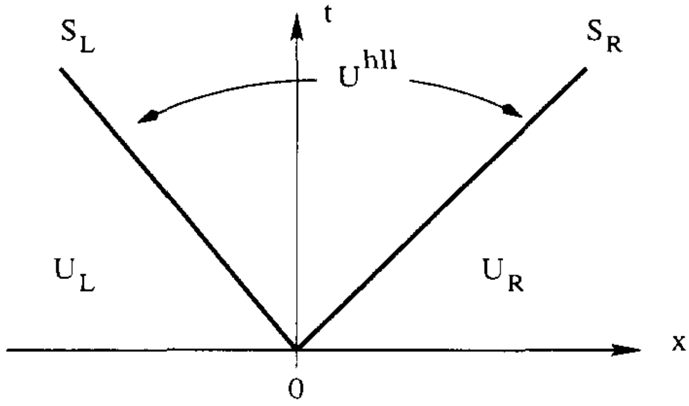

基礎方程式を$[0, t] \times [S_L t, S_R t]$で積分すると，Riemann fan内部の物理量$\bm{u}_{*}$は
$$
\bm{u}_{*} = \frac{1}{S_R - S_L}
\left[
  S_R \bm{u}_R - S_L \bm{u}_L + \bm{f}_L - \bm{f}_R
\right]
$$
と求まる．これはHLL平均などと呼ばれる．

---
同様に基礎方程式を$[0, t] \times [0, S_R t]$で積分し，$\bm{u}_{*}$を代入すると数値流束は
$$
\hat{\bm{f}}^{\rm HLL} =
\begin{cases}
\bm{f}_L & 0 \leq S_L
\\
\displaystyle
\frac{1}{S_R - S_L}
\left[
  S_R \bm{f}_L - S_L \bm{f}_R + S_L S_R \left( \bm{u}_R - \bm{u}_L \right)
\right]
& S_L \leq 0 \leq S_R
\\
\bm{f}_R & S_R \leq 0
\end{cases}
$$
から求まる．（$[0, t] \times [S_L t, 0]$で積分しても同じ結果が得られる．）

$S_L = \min(0, S_L)$, $S_R = \max(0, S_R)$と読み替えれば数値流束は常に
$$
\hat{\bm{f}}^{\rm HLL} =
\frac{1}{S_R - S_L}
\left[
  S_R \bm{f}_L - S_L \bm{f}_R + S_L S_R \left( \bm{u}_R - \bm{u}_L \right)
\right]
\tag{*}
$$
で与えられる．これがHLL法の数値流束である．流束の重み付き平均に散逸項$\bm{u}_R - \bm{u}_L$が付加されていることが分かる．

#### Q.4-8
HLL法の数値流束が$(*)$で与えられることを示せ．

---

- HLL法は固有値の最大値および最小値さえ求まれば方程式系によらない．固有値分解が必要ないのは大きな利点である．最大・最小固有値だけであれば比較的簡単に求まるが，固有値分解は解析的にも面倒だし数値的にも計算コストがかかる．例えばEuler方程式であれば最大・最小固有値は$\lambda_{\rm max/min} = v \pm C_s$である．

- Riemann fanが左右対称，すなわち$c \equiv S_R = -S_L$と書けるとする．これを代入すると
  $$
  \hat{\bm{f}}^{\rm LLF} =
  \frac{1}{2}
  \left[
  \bm{f}_L + \bm{f}_R - c \left( \bm{u}_R - \bm{u}_L \right)
  \right]
  \tag{*}
  $$
  これはRusanov法(local Lax-Friedrichs法）などとも呼ばれる．HLL法よりも散逸を強く取り入れている（すなわちより安定になっている）ことに注意しよう．

- Riemann fanの内部構造を無視しているため，中間固有値に対応するモード（Euler方程式で言えばエントロピーモード）を解像できない．散逸項が最大・最小固有値によって決まることを考えると，特に中間固有値と最大・最小固有値の差が大きいときには数値的な散逸を過度に取り入れてしまう．

---
### HLLC法 (Euler方程式)

HLL法のRiemann fan内部で物理量が一定という仮定をやめて，内部構造を考えてみよう．一般にはRiemann fanの内部構造は方程式系に依存するので，どんな保存則にも使えるというHLL法の利点は失われてしまうが，それによって解像度が向上するのであれば一考の価値はあるだろう．ここでは下図のようにEuler方程式について中間固有値（エントロピーモード）を1つ考え，Riemann fan内部を2状態で近似してみよう．エントロピーモードに対応する不連続は接触不連続面(Contact Discontinuity)なので，この2状態近似のRimeann解法は名前に"C"をつけてHLLC法と呼ばれる．

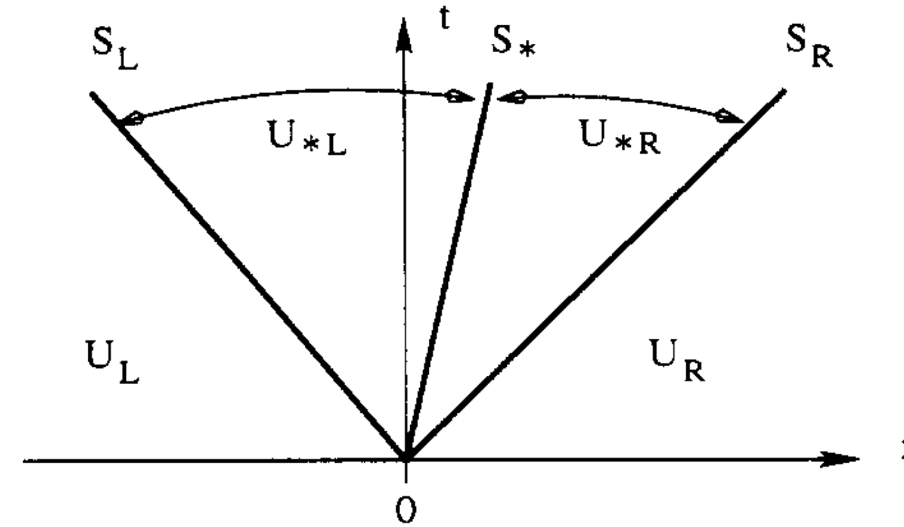

<!--
_header: Ref: Toro (2009)
-->
---

まずRiemann fan全体で積分をし，HLL平均$\bm{u}_{*}$の定義を用いると，以下の関係式を得る．
$$
\frac{S_* - S_L}{S_R - S_L} \bm{u}_{*L} +
\frac{S_R - S_*}{S_R - S_L} \bm{u}_{*R} = \bm{u}_{*} \tag{A}
$$

さらにRiemann fanの一部で同じように積分すると
$$
\begin{align}
& \bm{f}_{*L} = \bm{f}_L + S_L (\bm{u}_{*L} - \bm{u}_L) \tag{B}
\\
& \bm{f}_{*R} = \bm{f}_R + S_R (\bm{u}_{*R} - \bm{u}_R) \tag{C}
\end{align}
$$

したがって，$S_{*}, \bm{u}_{*L}, \bm{u}_{*R}$が与えられれば，数値流速は以下のように求まる．

$$
\hat{\bm{f}}^{\rm HLLC} =
\begin{cases}
\bm{f}_{L} & 0 \leq S_L
\\
\bm{f}_{*L} & S_L \leq 0 \leq S_*
\\
\bm{f}_{*R} & S_* \leq 0 \leq S_R
\\
\bm{f}_R & S_R \leq 0
\end{cases}
$$

#### Q.4-9
上記の式(A)，(B)，(C)を示せ．

---

Riemann fanの内部状態（$S_{*}, \bm{u}_{*L}, \bm{u}_{*R}$）を求めるにはいくつか仮定が必要になる．これにはいくつかの流儀があるが，ここでは最も簡単な例を考えよう．
まずは(B)および(C)式の質量および運動量保存の成分について具体的に考えると
$$
p_{*L} = p_L + \rho_L (S_L - v_L)(v_{*L} - v_L), \quad
p_{*R} = p_R + \rho_R (S_R - v_R)(v_{*R} - v_R)
$$
を得る．ここで中間固有値がエントロピーモードであることを考えると，接触不連続面の性質から$v_{*L} = v_{*R} = S_*$, $p_{*L} = p_{*R}$としてよいだろう．

ここでEuler方程式の具体的な形を使って少し計算すると，中間状態$K = L, R$について
$$
\bm{u}_{*K} = \frac{S_K \bm{u}_K - \bm{f}_K + p_{*K} \bm{D}_*}{S_K - S_*}
$$
とコンパクトに書けることが分かる．ただしここで$\bm{D}_{*} = (0, 1, S_*)$である．これを使って数値流速を書き直すと
$$
\bm{f}_{*K} =
\frac{
  S_* \left( S_K \bm{u}_K - \bm{f}_K \right) - S_K p_{*K} \bm{D}_{*}
}{
  S_K - S_*
}
$$
となる．

---
### 様々なHLL型Riemann解法（MHD方程式の場合）

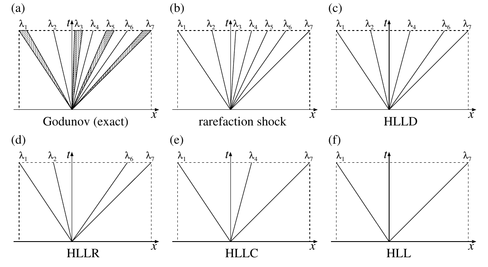

- 内部構造の近似の仕方によって様々な種類が存在する．
- 最も簡単なHLL法以外は一般に方程式系に陽に依存する．
- より正確に内部構造を考慮するRiemann解法は解像度は高いが，数値的に不安定になりやすい．

<!--
_header: Ref: Miyoshi & Kusano (2007)
-->
